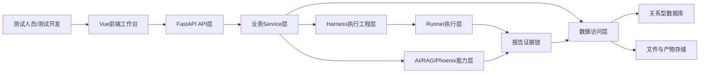
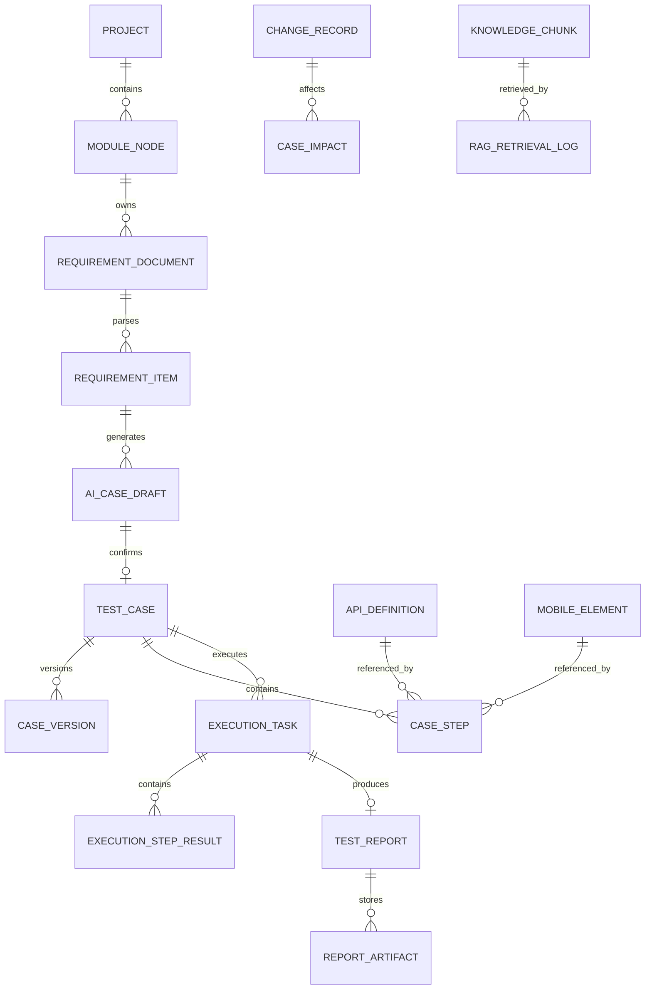
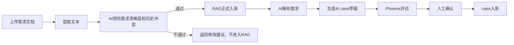
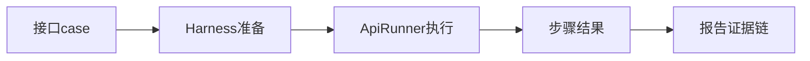
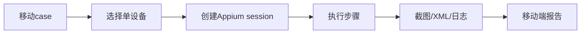
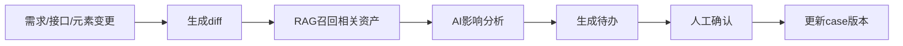
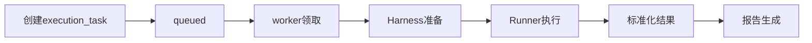
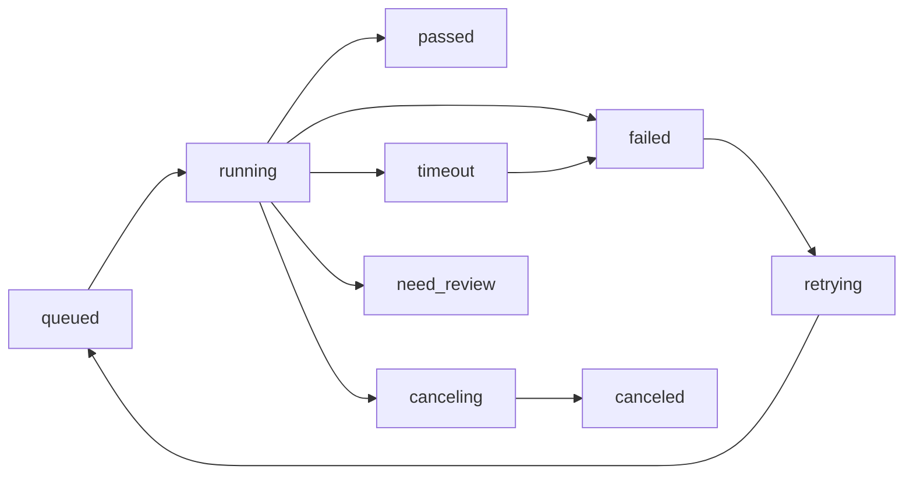

# AI测试平台技术设计文档

> **归档状态：已被替代。** 当前架构以 [平台技术架构](../architecture/平台技术架构.md) 和 [ADR](../architecture/adr/README.md) 为准；产品需求以 [PRD](../product/AI测试平台PRD.md) 为唯一事实源。本文仅用于历史追溯。

## 1. 文档定位

本文档基于 `docs/product/AI测试平台PRD.md`、`docs/product/AI测试平台模块功能逻辑确认.md` 和 `CONTEXT.md` 的最新口径重新整理，用于指导 `Ai_test_web` 架构设计、数据建模、模块拆分和完整交付。需求文档说明“为什么做、用户看到什么、模块边界是什么”，本文档说明“怎么实现、数据怎么存、模块怎么联动、执行怎么治理”。

## 2. 需求调整后的设计结论

最新版需求要求当前完整版本收敛为两条 基础业务链路：

```text
接口 case -> 执行 -> 报告
需求文档 -> AI case 草稿 -> 人工确认
```

移动端作为 移动端完整交付 最小可用能力：

```text
单设备 -> 单条移动端 case -> Appium 执行 -> 截图/XML/日志报告
```

增强能力/增强能力/预研能力 再逐步补齐变更治理、RAG、Phoenix、失败分析、Prompt、评估集、数据工厂、调度 Agent、移动端治理、AI 成本监控、Bug 集成、CI/CD、云真机、iOS 等能力。

## 3. 设计原则

### 3.1 能力闭环

平台按“公共能力 + 执行能力”组织。需求、case、执行、报告、AI、RAG、变更、评估、待办和配置属于公共能力；接口、移动端、LLM WebSocket、后面 Web/iOS/CI 属于执行能力。

### 3.2 资产结构化

需求、case、接口、元素、设备、执行、报告、变更、RAG、Prompt、评估样本都必须结构化存储。JSON 只能保存快照、可变配置和原始证据，状态、类型、模块、负责人、结论、失败分类、耗时、创建时间等核心查询字段必须列化。

### 3.3 AI 辅助人工确认

AI 输出默认是草稿、建议或分析结论。正式入库前必须支持人工确认、编辑、拒绝、合并和反馈。

### 3.4 Harness Engineering 前置

接口依赖、测试数据、环境上下文、清理、证据链不能散落在 Runner 内。平台在执行中心和 Runner 之间增加 Harness 层，统一处理环境准备、依赖解析、数据准备、变量注入、teardown、脏数据清理和证据增强。

## 4. 当前项目基础

后端当前基础：`FastAPI`、`Uvicorn`、`SQLAlchemy`、`Pydantic`、`SQLite`、`OpenAI SDK`、`arize-phoenix-evals`、`python-docx`、`pypdf`、`requests`。

后端关键目录：

```text
backend/app/main.py
backend/app/database.py
backend/app/config.py
backend/app/routers/
backend/app/services/
backend/app/models/
backend/app/schemas/
backend/app/skills/
```

前端当前基础：`Vue 3`、`Vue Router`、`Vite`、原生 `fetch` 封装、全局 CSS 变量和后台布局。

前端关键目录：

```text
frontend/src/app/
frontend/src/modules/
frontend/src/views/
frontend/src/shared/api/http.js
frontend/src/styles.css
```

## 5. 总体架构



| 层级 | 职责 |
| --- | --- |
| 前端展示层 | 页面、表单、工作台、日志、报告、确认流 |
| API 层 | 参数校验、权限校验、响应结构、路由分发 |
| Service 层 | 编排业务流程，例如生成 case、创建任务、生成报告 |
| Harness 层 | 环境、依赖、测试数据、变量、清理、证据链准备 |
| Runner 层 | 执行接口、移动端、LLM WebSocket 等任务 |
| AI 能力层 | LLM 调用、RAG 召回、Phoenix 评估、Skills |
| 数据访问层 | ORM、Repository、事务、查询和持久化 |
| 存储层 | 数据库、文件、日志、截图、XML、导出报告 |
| 外部集成层 | Appium、ADB、Bug 平台、CI/CD、模型服务 |

后端目标目录：

```text
backend/app/
├── routers/
├── services/
├── models/
├── schemas/
├── repositories/
├── skills/
├── harness/
├── runners/
├── evaluators/
├── connectors/
├── security/
└── utils/
```

## 6. 核心领域模型



| 领域 | 核心对象 |
| --- | --- |
| 项目与模块 | `projects`、`module_nodes` |
| 需求中心 | `requirement_documents`、`requirement_items`、`requirement_versions` |
| Case 中心 | `test_cases`、`case_steps`、`case_versions`、`ai_case_drafts` |
| 接口中心 | `api_definitions`、`api_environments`、`api_variable_sets` |
| 移动端 | `mobile_devices`、`mobile_apps`、`mobile_pages`、`mobile_elements` |
| 执行中心 | `execution_tasks`、`execution_batches`、`execution_step_results` |
| Harness | `dependency_records`、`test_data_records`、`cleanup_records` |
| 报告中心 | `test_reports`、`report_artifacts`、`report_confirmations` |
| RAG | `knowledge_chunks`、`rag_retrieval_logs` |
| AI/Phoenix/Prompt | `ai_call_logs`、`phoenix_evaluation_results`、`prompt_templates` |
| 治理 | `change_records`、`case_impacts`、`todo_items` |
| 安全审计 | `users`、`audit_logs`、`app_settings` |

## 7. 数据存储设计

| 数据类型 | 存储位置 | 说明 |
| --- | --- | --- |
| 业务结构化数据 | SQLite/MySQL/PostgreSQL | 需求、case、接口、执行、报告、变更 |
| 文件资产 | `uploads/` 或对象存储 | 需求文档、接口文档、APK、附件 |
| 执行产物 | `artifacts/` 或对象存储 | 截图、XML、日志、视频、导出报告 |
| RAG 片段 | 数据库，预留向量字段 | 文档片段、case、Bug、失败报告、负样本 |
| AI 调用记录 | 数据库 | token、耗时、成本、模型、功能分类 |
| 审计日志 | 数据库 | 高风险操作、配置变更、查看原文、导出 |

必须结构化列化：状态、类型、归属、结论、统计、时间等字段。

适合 JSON：请求/响应快照、断言结构、变量上下文、capability、AI 原始输出、diff、RAG 召回结果、Prompt 变量定义。

## 8. 核心数据字典

### 8.1 需求与 AI case

`requirement_documents`：存储文档元数据，包括 `project_id`、`module_id`、`title`、`file_path`、`file_hash`、`version`、`doc_type`、`parse_status`、`uploaded_by`。

`requirement_items`：存储 AI 解析后的结构化需求，包括 `document_id`、`module_id`、`title`、`description`、`priority`、`risk_level`、`source_text`、`ai_summary`、`status`。

`ai_case_drafts`：存储 AI 生成 case 草稿，包括 `requirement_id`、`document_id`、`case_type`、`content_json`、`original_ai_output`、`edited_content_json`、`phoenix_result_json`、`reject_reason`、`merge_target_case_id`、`status`、`reviewer`、`review_comment`。状态应覆盖 `generated/evaluated/pending_review/accepted/edited/merged/rejected/deprecated/archived`，高分只表示推荐通过，所有 AI case 都必须由测试人员确认后才能入库。

### 8.2 Case 与步骤

`test_cases`：统一存储功能、接口、移动端、LLM case，包括 `project_id`、`module_id`、`requirement_id`、`title`、`case_type`、`priority`、`status`、`source`、`current_version`、`owner`。

`case_steps`：统一步骤表，核心字段包括 `case_id`、`阶段`、`sort_order`、`step_type`、`action`、`target_ref`、`input_json`、`extract_json`、`assertion_json`、`continue_on_failure`、`timeout_seconds`。

`case_versions`：保存 case 版本快照、修改原因、来源和创建人。

### 8.3 接口、环境和变量

`api_definitions`：接口定义，包括 `module_id`、`name`、`method`、`path`、`auth_type`、`request_schema`、`response_schema`、`status`。

`api_environments`：环境配置，包括 `env_name`、`http_base_url`、`ws_base_url`、`default_headers`、`login_api`。

`api_variable_sets`：变量和鉴权，包括 `variables_json`、`secret_refs_json`、`auth_config_json`。

### 8.4 执行和报告

`execution_tasks`：执行任务事实来源，包括 `case_id`、`execution_type`、`environment_id`、`device_id`、`status`、`trigger_type`、`retry_count`、`max_retries`、`timeout_seconds`、`cancel_requested`、`worker_id`、`heartbeat_at`、`context_json`。

`execution_step_results`：步骤结果，包括 `task_id`、`step_id`、`阶段`、`status`、`error_category`、`request_snapshot`、`response_snapshot`、`variable_snapshot`、`assertion_result`、`artifact_refs`、`duration_ms`。

`test_reports`：报告主表，包括 `task_id`、`batch_id`、`report_type`、`conclusion`、`pass_rate`、`failure_category`、`summary`、`ai_analysis`、`retention_until`。

### 8.5 Harness 数据

`dependency_records`：记录步骤依赖链，包括 `task_id`、`case_id`、`from_step_id`、`to_step_id`、`dependency_type`、`required`、`status`、`failure_reason`。

`test_data_records`：记录测试数据归属和清理策略，包括 `task_id`、`case_id`、`environment_id`、`resource_type`、`resource_id`、`resource_key`、`cleanup_strategy`、`cleanup_status`、`expire_at`、`cleaned_at`。

`cleanup_records`：记录清理动作，包括 `task_id`、`data_record_id`、`cleanup_step_id`、`status`、`error_message`、`retried_count`。

### 8.6 RAG、AI、Prompt、Phoenix

`knowledge_chunks`：RAG 知识片段，包括 `source_type`、`source_id`、`chunk_text`、`summary`、`keywords`、`module_id`、`status`、`knowledge_zone`、`trust_level`、`masking_rule_version`、`embedding`。`knowledge_zone` 用于区分正式知识库和负样本库；需求文档片段只有 AI 预检通过后才能进入正式知识库。

`rag_retrieval_logs`：记录召回过程，包括 `query_text`、`skill_name`、`coarse_count`、`rerank_count`、`returned_chunk_ids`、`user_selected_ids`。

`ai_call_logs`：记录 AI 调用成本和稳定性，包括 `feature`、`provider`、`model`、`prompt_version`、`input_tokens`、`output_tokens`、`duration_ms`、`estimated_cost`、`status`。

`prompt_templates`：Prompt 模板，包括 `name`、`skill_name`、`case_type`、`version`、`file_path`、`template_text`、`variables_json`、`status`、`evaluation_status`、`activated_at`。Prompt 可文件化存储，通过文件头或前端配置绑定 Skill；修改后必须先跑评估集并经测试人员确认后生效。

`phoenix_evaluation_results`：Phoenix 评估结果，包括 `target_type`、`target_id`、`evaluator`、`score`、`threshold`、`passed`、`label`、`rationale`。

## 9. 后端框架运用设计

Router 只负责参数校验、权限校验、依赖注入、调用 Service 和返回统一响应。

推荐 API 分组：

```text
/api/overview
/api/requirements
/api/cases
/api/apis
/api/devices
/api/executions
/api/reports
/api/ai
/api/rag
/api/changelog
/api/evaluations
/api/settings
/api/todos
```

### 9.1 本轮前端页面重构边界（2026-05-19 全量重建）

为回应“删除旧前端并按专业平台风格重建”的要求，本轮明确把页面可见范围写入技术设计：

- 页面信息架构：当前 UI 暴露首页 / 质量驾驶舱、需求中心、Case 中心、系统设置 4 个导航入口；其他模块属于后面规划，不在导航层展示。
- 需求中心边界：文档列表、上传、详情、原文预览、解析结果（有则展示）、解析与入库门禁说明；真实需求树 CRUD、归档 / 回收站、完整状态机仍按 T04 剩余切片推进。
- Case 中心边界：正式 case 列表 / 详情 / 基础 CRUD、来源追溯、人工确认记录、覆盖信息、最近执行摘要；版本快照、废弃流程、AI 草稿队列页仍按 T08 剩余切片推进。
- 系统设置边界：AI 模型列表（masked key、检测、设默认）、安全脱敏、报告策略；环境 / Appium 仅占位；完整审计日志 UI 仍按 T03/T14 剩余切片推进。
- 视觉风格：企业级浅色平台（深色 sidebar + 白底卡片 + 三栏工作台），验证脚本覆盖导航、页面文案、样式 tokens 与 build。
- 测试边界：`verify-navigation.mjs`、`verify-page-style.mjs`、`verify-overview-page.mjs`、`verify-requirements-page.mjs`、`verify-cases-page.mjs`、`verify-settings-page.mjs`。

### 9.1 本轮前端页面重构边界（2026-05-19 历史记录）

为回应“设计文档未体现页面重构”的问题，本轮明确把页面可见范围写入技术设计：

- 页面信息架构：当前 UI 只把首页 / 质量驾驶舱、需求中心、Case 中心作为可点击导航入口；其他模块属于后面规划，暂不在导航层展示。
- 需求中心边界：当前页面承担文档资产工作台、需求关系树、原文预览、解析与入库门禁说明、AI 草稿人工确认入口；后端真实解析、历史对比、逻辑检查规则仍按后面 T04/T05/T07 任务继续补齐。
- Case 中心边界：当前页面承担正式 case 资产列表、可信资产边界说明、来源追溯、人工确认记录、覆盖信息和最近执行摘要；完整版本快照、关键字段变更后重新确认、执行报告联动仍按 T08 剩余切片推进。
- 视觉风格：已实现页面采用工作台式深色头图、卡片和三栏资产布局，区别于原先仅表格 / 表单的后台页。
- 测试边界：`frontend/scripts/verify-requirements-page.mjs`、`frontend/scripts/verify-cases-page.mjs`、`frontend/scripts/verify-navigation.mjs`、`frontend/scripts/verify-page-style.mjs` 分别验证需求中心、Case 中心、可见导航和页面风格，不把隐藏模块视为已完成。

| Service | 职责 |
| --- | --- |
| RequirementService | 文档上传、解析、版本、AI case 生成触发 |
| CaseService | case CRUD、版本、AI 草稿确认 |
| ApiDefinitionService | 接口定义、环境、变量、鉴权 |
| ExecutionService | 创建任务、状态流转、取消、重试 |
| HarnessService | 环境准备、依赖处理、数据准备、清理 |
| ReportService | 报告生成、证据链、导出、人工确认 |
| RagService | 知识入库、召回、召回日志 |
| AiOrchestrationService | AI 编排校验、失败分析、case 生成 |
| ChangeService | 变更快照、diff、影响分析 |
| SettingsService | 配置中心 |

| Skill | 职责 |
| --- | --- |
| RequirementParseSkill | 需求文档结构化解析 |
| CaseGenerateSkill | 生成 case 草稿 |
| InterfaceParseSkill | 解析接口文档 |
| RagRetrieveSkill | 检索知识片段 |
| RequirementDiffSkill | 新老需求对比 |
| ConflictDetectSkill | 识别需求、接口、case 冲突 |
| CaseImpactSkill | 变更影响 case |
| CoverageEvaluateSkill | 覆盖度评估 |
| PhoenixEvaluateSkill | 质量门禁评估 |
| FailureAnalysisSkill | 失败归因 |
| PromptOptimizeSkill | Prompt 优化建议 |

## 10. Harness 与 Runner 设计

Harness 层位于执行中心和 Runner 之间。

| Harness | 职责 |
| --- | --- |
| EnvironmentHarness | 加载环境、headers、变量、密钥引用、token |
| DependencyHarness | 处理接口依赖、前置步骤、变量传递、阻断策略 |
| DataHarness | 测试数据生成、标记、隔离、记录 |
| CleanupHarness | teardown、清理重试、脏数据扫描 |
| ObservabilityHarness | 依赖链、变量上下文、清理结果、证据链增强 |

Harness 输入：

```json
{
 "task_id": "exec-001",
 "case_id": "case-001",
 "environment_id": "dev",
 "variable_set_id": "default",
 "device_id": "emulator-5554",
 "run_options": {
 "cleanup_strategy": "after_run",
 "fail_fast": true,
 "timeout_seconds": 300
 }
}
```

Harness 输出：

```json
{
 "environment": {},
 "variables": {},
 "dependency_graph": [],
 "test_data_records": [],
 "cleanup_plan": [],
 "artifacts_dir": "artifacts/exec-001",
 "masked_context": {}
}
```

Runner 输入：

```json
{
 "task_id": "exec-001",
 "case_id": "case-001",
 "case_type": "api",
 "steps": [],
 "environment": {},
 "variables": {},
 "context": {},
 "timeout_seconds": 300,
 "artifacts_dir": "artifacts/exec-001"
}
```

Runner 输出：

```json
{
 "task_id": "exec-001",
 "status": "failed",
 "duration_ms": 1200,
 "step_results": [],
 "variables_delta": {},
 "artifacts": [],
 "error_category": "assertion",
 "error_message": "expected code=0, actual code=401",
 "retryable": true,
 "report_summary": "登录接口断言失败"
}
```

Runner 约束：不直接生成最终报告，不直接修改业务资产，必须支持取消、超时和资源释放，必须按步骤输出标准化结果。

## 11. 核心业务流程

### 11.1 需求文档到 AI case 草稿



模块完整交付 只要求文档上传、文本提取、AI 生成草稿、人工确认入库和保留 AI 原始输出。增强能力再增强 RAG 正式入库、Phoenix 门禁、批量接受、合并到已有 case 和反馈样本库。需求文档必须先经过 AI 预检，未通过时只返回修改建议，不进入正式 RAG。

### 11.2 接口 case 执行报告



模块完整交付 目标是接口定义基础维护、接口 case 步骤、变量提取、断言、单条执行和基础报告。

### 11.3 移动端最小可用



移动端完整交付 只做单设备、单条移动 case、基础 Appium 执行、截图、XML、日志，不追求完整设备中心治理。

### 11.4 变更影响分析



### 11.5 执行到报告



## 12. 自动化执行与任务治理



接口执行可能短，但移动端和 LLM WebSocket 是长任务。API 请求只负责创建任务、查询任务、请求取消和触发重试。实际执行由后台 worker 处理，并持续回写任务状态、worker 心跳、步骤结果、日志、产物、取消和超时结果。

队列演进：模块完整交付 使用进程内后台任务或轻量 worker + 状态表；增强能力 引入 Celery/RQ/Arq/APScheduler 之一；预研能力 拆分独立 worker 服务、队列、worker 心跳、任务抢占。

取消、重试和超时规则：取消任务进入 `canceling`，Runner 释放资源并保留日志和产物；只允许对 `retryable` 失败项重试；步骤超时和任务超时分别记录，worker 心跳超时后调度层释放锁。

## 13. Harness Engineering 标准化执行体系

标准生命周期：

```text
load_case
prepare_environment
resolve_dependencies
prepare_test_data
run_setup_steps
run_test_steps
run_teardown_steps
collect_artifacts
cleanup_dirty_data
generate_report
```

case 步骤分为：

```text
setup_steps
test_steps
teardown_steps
```

依赖处理规则：setup 失败则主步骤默认 `blocked`；上游变量提取失败则下游依赖步骤 `blocked`；依赖失败和主接口失败分开分类；依赖链写入 `dependency_records` 并展示在报告里。

典型依赖链：

```text
登录 -> 创建订单 -> 支付订单 -> 查询订单 -> 清理订单
```

测试数据必须记录归属任务、case、环境和资源类型，必须有清理策略，并使用唯一命名避免并发污染。清理失败要生成待办或风险提醒。

| 清理策略 | 说明 |
| --- | --- |
| none | 不清理，适合只读或不可删除数据 |
| manual | 人工清理 |
| after_run | 执行后自动清理 |
| scheduled | 定时扫描清理 |

EnvironmentHarness 负责加载环境配置、变量集、密钥引用、token、headers，并校验环境可用性。Runner 不直接读取密钥，也不直接拼接鉴权逻辑。

ObservabilityHarness 要把依赖链、setup/test/teardown 分组结果、测试数据创建记录、清理结果、环境快照、变量上下文和脱敏状态写入报告。

## 14. 报告与证据链

| 结论 | 说明 |
| --- | --- |
| passed | 主步骤通过 |
| failed | 主步骤失败 |
| blocked | 前置依赖失败 |
| timeout | 超时失败 |
| need_review | AI 评估、证据不足或结果不稳定 |
| canceled | 用户取消 |

证据类型：

- 接口证据：请求、响应、耗时、变量提取、expected/actual。
- 移动端证据：设备信息、App 版本、capability、截图、XML、Appium 日志、崩溃、ANR、系统弹窗。
- LLM 证据：输入 prompt、多轮上下文、WebSocket 消息流、模型输出、Phoenix/evaluator 评分、RAG 召回片段。
- Harness 证据：依赖链、测试数据记录、清理结果、环境快照。

默认报告保留 14 天；失败报告可标记长期保留；导出默认脱敏；模块完整交付 支持 HTML、Markdown、JSON 导出，增强能力 支持 Excel 导出，PDF 作为后面可选增强；导出行为写审计日志。

## 15. AI、RAG、Phoenix 与 Prompt

AI 调用治理记录功能分类、provider、model、prompt_version、输入 token、输出 token、耗时、失败原因和估算成本。

RAG 分为四层：

| 层 | 说明 |
| --- | --- |
| 入库层 | 文档、case、Bug、报告、日志、负样本切片 |
| 检索层 | 粗排、精排、权重、范围控制 |
| 展示层 | 摘要、来源、片段、跳转原文 |
| 运营层 | 人工 pin、排除、失效、负样本管理 |

可入库内容：AI 预检通过的需求文档片段、已确认 case、被拒绝 AI case 负样本、Bug 记录、失败报告摘要、WebSocket 协议 schema、脱敏后的评估样本、Prompt 评估结论。线上原始 WebSocket 对话日志不进入 RAG 正文，只用于解析协议结构。

不可直接入库内容：未脱敏 token、密码、Cookie、Authorization、手机号、身份证等敏感字段、未确认高风险 AI 输出。

RAG 与业务流程：

```text
需求文本 -> RAG召回相似需求/历史case/Bug -> AI生成草稿 -> Phoenix评估 -> 人工确认
变更diff -> RAG召回相关case/失败报告/Bug -> AI分析影响 -> 生成待办
失败报告 -> RAG召回相似失败 -> AI归因 -> 人工确认
```

Phoenix 用于 AI case 可执行性、需求忠实度、幻觉检测、重复 case 检测和 LLM 回答质量。高分进入人工确认，低分标记 `need_review`，明显错误进入拒绝候选或负样本。

Prompt 支持文件化、版本化、与 Skill 绑定、变量占位、临时编辑、修改后跑评估集、回滚和效果指标。

## 16. 变更、回归、评估和质量运营

变更流程：

```text
保存快照 -> 生成diff -> RAG召回 -> AI影响分析 -> 生成待办 -> 人工确认 -> 更新case版本
```

评估集用于 Prompt 修改后的回归、LLM WebSocket 稳定性评估、Phoenix 门禁校验和失败分析能力回归。

回归集来源包括人工归档、变更推荐、Bug 修复推荐、高频失败模块和 基础业务链路。

用例治理能力包括废弃和历史留痕、flaky 标记、月度健康度检查、大回归集维护、自动推荐补充或下线 case。

## 17. 移动端自动化设计

移动端完整交付 只做单设备、单 App、单条移动 case、Appium 基础动作、截图、XML、日志。

增强能力 补齐设备中心治理、设备锁续约、App 管理、元素库、主定位和备用定位、公共步骤、单步调试、移动端失败分类。

预研能力 扩展多设备并发、弱网、切后台、杀进程、权限弹窗、AI 视觉兜底、云真机和 iOS。

## 18. Bug、待办与调度 Agent

Bug 集成目标：标准 Bug 模型、报告关联 Bug、case 关联 Bug、Bug 修复后推荐回归 case、Bug 内容作为 RAG 依据。

待办来源：AI case 待确认、变更影响待处理、报告失败待确认、清理失败、成本超限、高风险需求、flaky case 复核。

调度 Agent 只做建议和辅助调度，不直接绕过人工治理。

## 19. 安全、脱敏、权限和审计

模块完整交付 必须实现统一脱敏函数、敏感字段规则、密钥不明文返回、报告导出脱敏、AI/RAG/Phoenix 输入前脱敏、查看未脱敏内容写审计。

默认敏感字段：

```text
password
token
authorization
cookie
secret
api_key
phone
id_card
```

| 角色 | 权限 |
| --- | --- |
| admin | 系统配置、用户、导出、删除、密钥管理 |
| tester | 需求、case、执行、报告、AI 工作台 |
| viewer | 只读查看报告和资产 |

密钥规则：密钥只允许写入和引用，不允许接口明文返回；变量集用 `secret_refs_json` 保存敏感引用；普通日志不能出现 token、Cookie、Authorization；生产建议接入密钥管理服务或应用级加密。

## 20. 系统配置中心

| 分类 | 配置 |
| --- | --- |
| AI 模型 | provider、model、api_key、base_url、temperature、max_tokens |
| Phoenix | evaluator、threshold、module、enabled |
| RAG | 粗排数量、精排数量、展示数量、权重、负样本开关 |
| Prompt | 默认模板、版本、临时编辑、评估集开关 |
| 环境 | http_base_url、ws_base_url、login_api、default_headers |
| Appium | capability 模板、设备级覆盖、App 级覆盖 |
| 报告 | 保留天数、产物保留、导出格式、导出脱敏 |
| 成本 | 模型价格、token 上限、调用次数上限、告警阈值 |

## 21. API 与前后端协作规范

统一响应：

```json
{
 "code": 0,
 "message": "success",
 "data": {},
 "trace_id": "req-xxx"
}
```

分页响应：

```json
{
 "items": [],
 "total": 0,
 "page": 1,
 "page_size": 20
}
```

命名规范：API 路径使用复数资源名，数据库字段使用 snake_case，前端变量使用 camelCase，状态枚举使用小写字符串。

## 22. 分阶段落地路线

### 22.1 模块完整交付：当前完整版本主链路

两条主链路：

1. `接口 case -> 执行 -> 报告`
2. `需求文档 -> AI case 草稿 -> 人工确认`

同时必须做：`execution_tasks` 状态表、Runner 统一协议、Harness 基础能力、基础报告证据链、安全脱敏。

### 22.2 移动端完整交付：移动端最小可用

单设备、单条移动 case、基础 Appium、截图/XML/日志，不追求完整设备中心治理。

### 22.3 增强能力：治理增强

变更中心、RAG 知识库、Phoenix 门禁、AI 失败分析、评估集和回归集、后台 worker/任务队列、数据工厂和脏数据清理、统一待办、权限和审计增强。

### 22.4 增强能力：高级 AI 测试能力

LLM WebSocket 多轮测试、模型可靠性评估、Prompt 中心、成本监控、调度 Agent。

### 22.5 预研能力：扩展能力

多设备并发、AI 视觉兜底、Bug 平台双向关联、CI/CD、云真机、iOS、Web 自动化。

## 23. 风险与应对

| 风险 | 应对 |
| --- | --- |
| 完整交付范围过大 | 收缩为两条主链路，移动端放到 移动端完整交付 |
| FastAPI 同步请求承载长任务 | 使用 `execution_tasks` 状态机，增强能力 引入队列/worker |
| JSON 字段滥用 | 核心查询字段列化，JSON 只存快照和可变结构 |
| 接口依赖不清晰 | 引入 DependencyHarness 和 dependency_records |
| 脏数据污染 | 引入 test_data_records、cleanup_records 和清理策略 |
| AI 输出不稳定 | Phoenix + 人工确认 + 负样本库 |
| RAG 污染 | 入库前脱敏，未确认高风险 AI 输出不入库 |
| 报告无法复盘 | 模块完整交付 保存请求、响应、断言、变量上下文 |
| 敏感数据泄露 | 模块完整交付 前置脱敏、密钥引用、审计 |
| Runner 耦合业务 | Runner 只执行并返回标准结果，不改业务资产 |

## 24. 与需求文档章节映射

| 需求章节 | 技术设计对应章节 |
| --- | --- |
| §1-§6 背景、目标、架构 | §1-§5 |
| §7 详细功能需求 | §6-§11、§14-§18 |
| §8 自动化执行模块 | §9-§13、§17 |
| §9 核心业务链路 | §11 |
| §16 模块完整交付 范围 | §22 |
| §23 RAG 与 Skills | §9.3、§15 |
| §24 LLM WebSocket、数据工厂、调度 | §12、§13、§15、§22 |
| §25 报告证据链 | §14 |
| §26 脱敏、权限、审计 | §19 |
| §27 AI case 治理 | §8.1、§11.1、§15.5 |
| §28 RAG 生命周期 | §15 |
| §29 评估集/回归集 | §16 |
| §30 Prompt 中心 | §15.6、§20 |
| §31 移动端自动化 | §17 |
| §32 用例资产治理 | §16 |
| §33 Bug 集成 | §18 |
| §34 待办与调度 Agent | §18 |
| §35 首页/工作台 | §10、§18 |
| §36 单项目和模块树 | §6、§8 |
| §37 系统设置 | §20 |
| §38 AI 成本监控 | §15.1、§20、§22.4 |

## 25. 结论

新版技术设计按真实落地顺序组织：短期跑通接口 case 执行报告闭环和需求生成 AI case 草稿确认闭环，同时落地 `execution_tasks` 状态机、Runner 统一协议、Harness 基础能力、安全脱敏和报告证据链；中期补齐 RAG、Phoenix、变更影响分析、数据工厂、脏数据清理、后台 worker、评估集、Prompt、统一待办和成本监控；长期形成覆盖需求、case、接口、移动端、执行、报告、变更、RAG、AI 治理和质量运营的一体化 AI 测试平台。
